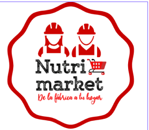

# NutriMarket de Nutricrop

Somos la principal empresa de consumo masivo en Perú. Queremos transformar el mercado a través de una nueva red de distribución que permita ofrecer productos de alta calidad a precios accesibles a personas de bajos recursos económicos.

## Reto
Pensando en generar valor y bienestar en nuestra gente buscamos una nueva forma de compra y venta de productos exclusiva para nuestros operarios y sus familias.

El modelo ideado asegura la compra de productos con un tope de crédito al mes de 300 soles por parte de nuestros operarios. También se muestra el precio a comprar y sugerido a vender del producto, dándoles la oportunidad de venderlos a sus contactos y en su zona de influencia, generando así un ingreso adicional para ellos y a la vez nosotras reducimos intermediarios en nuestra red de distribución

## [Nutricorp deploy](https://credicorp01-d7138.web.app/)
**users**
- ana@nutricorp.com  ana123456
- juan@nutricorp.com 123456789

## Stack Utilizado
- React
- Firebase

## Squad 1
- Wendy Hachilla
- Denisse Marinel
- Mairelis Montilla
- Raquel Pastor

